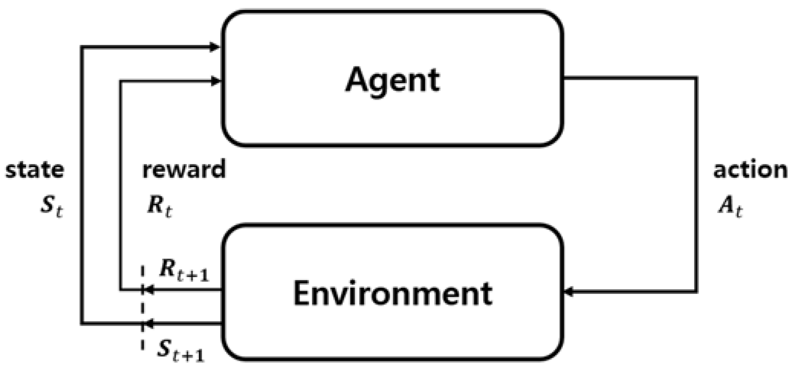

********************
Agents specificities
********************

pypownet has an Environment interface, which wraps the backend game instance, and allows a RL-focused mechanism that can be used by the agents (also called models or controlers) which act as grid conduct operators.

At each timestep, upon reception of the current observation of the game, an agent is supposed to produce an action, that will be applied onto the grid, producing the next timestep observation (along with the associated reward) which will be given to the agent to produce a new action and so on.
The following figure represents the typical RL loop, which greatly influences pypownet approach:

    Typical feedback loop in Reinforcement Learning which greatly influences the mechanism of the simulator.
    On the image, the link of the reward is equivalent to the function ``feed_reward``, while the agent block is equivalent to the function ``act`` taking an observation (or state) as input, and outpouting an action.

In more details, an agent should be a python daughter class of the pypownet class **pypownet.agent.Agent** which contains two mandatory methods:

    - ``act`` which should output a **pypownet.game.Action** given a **pypownet.environment.Observation**
    - ``feed_reward`` which is the gateway functions that allows model to process the reward signal, along with the action taken and the consequent observation

.. code-block:: python
    :caption: agent.py
    :linenos:

    import pypownet.environment

    class Agent(object):
        """ The template to be used to create an agent: any controler of the power grid is expected to
        be a daughter of this class.
        """

        def __init__(self, environment):
            """Initialize a new agent."""
            assert isinstance(environment, pypownet.environment.RunEnv)
            self.environment = environment

        def act(self, observation):
            """Produces an action given an observation of the environment. Takes as argument an observation
            of the current state, and returns the chosen action."""
            # Sanity check: an observation is a structured object defined in the environment file.
            assert isinstance(observation, pypownet.environment.Observation)

            # Implement your policy here.
            do_nothing_action = self.environment.action_space.get_do_nothing_action()

            # Sanity check: verify that the action returned is of expected type and overall shape
            assert self.environment.action_space.verify_action_shape(action)
            return do_nothing_action

        def feed_reward(self, action, consequent_observation, rewards_aslist):
            pass

.. Hint:: Agents without an explicit implementation of **feed_reward** do not learn at any point because they never receive the reward signal.

When an agent is specified as input of pypownet, the simulator will look for its ``act`` and ``feed_reward`` methods (or take the ones of the parent class **pypownet.agent.Agent** which is essentially a do-nothing policy), and use them for its step algorithm:

.. code-block:: python
   :caption: Step algorithm of the simulator. input: an agent A
   :emphasize-lines: 3, 10

    observation = simulator.start_game()
    for each timestep:
       action = A.act(observation)

       new_observation, reward_aslist, is_done = simulator.action_step(action)

       if is_done:
            new_observation = simulator.reset()

       A.feed_reward(action, new_observation, rewards_aslist)
       observation = new_observation

In short, every daughter class should have at least the following structure (any additional methods can be added; sanity checks should remain as they ensure the data types won't raise errors):

.. code-block:: python
   :linenos:

    import pypownet.environment
    import pypownet.agent

    class CustomAgent(pypownet.agent.Agent):
        def __init__(self, environment):
            assert isinstance(environment, pypownet.environment.RunEnv)
            super().__init__(environment)

        def act(self, observation):
            assert isinstance(observation, pypownet.environment.Observation)

            # Implement your policy here.
            action = self.environment.action_space.get_do_nothing_action()

            assert self.environment.action_space.verify_action_shape(action)
            return action

        def feed_reward(self, action, consequent_observation, rewards_aslist):
            pass