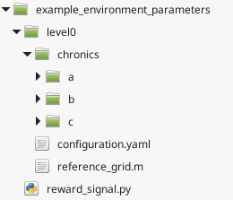
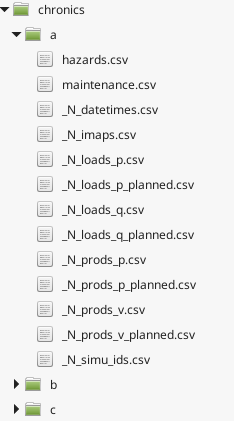

**********************
Environment parameters
**********************

Context
=======

Some mechanisms and inputs of the game are parameterizable to ensure that the users of the package have some control with respect to the simulations to be run. New simulations environments can be created with any virtual grid (provinding an initial grid case) and an associated set of grid timestep entries to be injected.

.. Hint:: The simulator has primarly been designed for RL research; consequently, the overall parameters environment organization is influenced for RL integration.

Parameters are organized into a generic folder structure:

An environment parameters is made of the following elements:

    - one reference grid (defines static parameters of the simulated power grid)
    - sets of chronics (defines the temporal data driving the inputs of the grid environment)
    - a configuration file (contains parameters for some mechanisms of the simulator)
    - (*optional*) a reward signal python file (implements the formula to compute a reward based on a observation and an action)

Before rewieving the details about each of these elements, pypownet comes with a helper that creates a template parameters environment. The script can be launched using::

    python -m parameters.build_new_parameters_environment

The terminal will ask you several questions relative to the latter elements, and then build the overal architecture of the environment. After the execution of this script, you will need to:

    - (*mandatory*) fill the data for the chronics
    - (*optional*) modify the default values of the auto-generated configuration file
    - (*optional*) modify the reward signal of the file reward_signal.py.

Default environment parameters
==============================

Creating new environment parameters
===================================

Reference grid
--------------
A reference grid is a case file in matlab format defining a grid (or more precisally, a *photo* of a grid, with instant injections). This file will be read by the simulator to load the electrical parameters of the grid, including for instance reactances and susceptances of lines, or the substations of which the grid productions are wired.

Currently, the simulator expects a IEEE-format case file for the reference_grid.
.. Hint:: Such files `can be found on the Matpower official repository <https://github.com/MATPOWER/matpower/tree/master/data>`__. You can also find some details about the value of the matrices and columns of the IEEE format `here <http://www.pserc.cornell.edu/matpower/docs/ref/matpower5.0/caseformat.html>`__.

The simulator cannot work with such a grid without some modifications, including the addition of artificial buses that will emulate the sister nodes of the original substations of the grid (two sister nodes per substation), and renaming and sorting the buses original ids. The ``build_new_parameters_environment`` script already performs this operation from the prompted filepath of the reference grid.

In a given environment, you might want to modify only the reference grid (for example, specifiying a different topological configuration) without modifying the other resources (reward_signal.py, chronics etc). In that case, you can run the following script, which will produce a valid reference grid for pypownet::

    python -m parameters.make_reference_grid CASE_FILE_FILEPATH

where CASE_FILE_FILEPATH is the path to a grid case file (e.g. case30.m).

Chronics
--------
In pratice, given injections and a grid topology, the flows within the grid will converge to a steady-steate, where electricity is carried from producers (e.g. nuclear central) toward consumers (e.g. a city).
In real condition, the amount of demand cannot be controled: in other words, the injections relative to the loads are external to the operation of grid conduct.
Besides, for several countries, the company responsible for natiowide grid conduct is different than the one responsible for the nationwide electricity production: in other words, the values of the productions are not in control of tehe grid conduct operators (they are by some other company, which also ensures that there is enough production to satisfy all demand).
Those two macro aspects underlines that injections are effectively an input of the grid system in the context of grid conduct of natiowide scale.

For reproducibility purposes, productions and loads injections are thus an entry of the system (and not generated on the fly by the software), which can be controlled by a meta-user creating new chronics sets.
An advantage to this approach is that the meta-user can control the timestep of the simulation: chronics entirely define the behavior of the flows within a grid. If the values of injections of a chronic have been generated with a timestep of 2 minutes, then the software will naturally be discretized into 2 minutes timesteps.

Chronics define the precise values of the entries of the Environment in which the grid will be subjected to through time. A *game level* folder contains one **chronics** folder, which contains one or several folders, which are the chronic folders (in the previous image, those chronic folders are named **a**, **b**, and **c**).
More precisally, a chronic folder is made of 13 CSV files containing the temporal data for all the entries of the simulated grid system which are grouped into  categories:

    (i) grid injections (productions and consumptions temporal nominal values)

    (ii) grid previsions of injections which are given to the agents

    (iii) maintenance planned operations and grid external line breaking events (e.g. thunder breaking a line)

    (iv) simulation datetime and absolute IDs

    (v) power lines nominal thermal limit for the whole chronic

.. Important:: The delimiter in CSV files is always ';'

For visual purposes, here is a list of the files names in a chronic:

.. Important:: The software will seek files with the exact filenames indicating in the above figure; your chronics should eventually contain 13 CSV files with the same name as listed above.

1. Grid injections
^^^^^^^^^^^^^^^^^^
The grid injections (also called *realized injections*, since the values will effectively be an unmodified input of the grid) refer to four values:

    - the active power (P) of productions
    - the voltage magnitude (V) of productions
    - the active power (P) of consumptions
    - the reactive power (Q) of consumptions

.. Hint:: In short, injections are the P and V values of productions, and P and Q values of loads, hence the respective names PV buses and PQ buses

The respective names of the associated chronic files are:

    - _N_prods_p.csv
    - _N_prods_v.csv
    - _N_loads_p.csv
    - _N_loads_q.csv

Each of these CSV files should have a header (which is not used in practice but mandatory) line of the desired number of file columns, followed by lines of ';'-separated values. Each line will correspond to one timestep, such that consecutive lines represent the injections of consecutive timesteps.
The columns define the nominal values for each elements. For instance, if the grid is made of 5 productions, then both **_N_prods_p.csv** and **_N_prods_v.csv** should be made of 5 columns (so 4 ';' per line).

In practice, all of the active power values of productions are non-negative, because productions do produce active power. Sometimes, productions undergo some maintenance process (e.g. cleaning or repairing). This aspect can be controlled within the voltage magnitudes of productions (file **_N_prods_v.csv**), by setting the associated active production value to 0 (a production producing 0 effectively does not produce any electricity), or by setting the nominal value of the production to <= 0.
Usually, productions voltage magnitudes are close to 1 (ranging from 0.94 to 1.06) in per-unit (understand: in the chronic file of production voltages). Any excessive value will almost automatically lead to a game over situation caused by a non-converging loadflow.

For the loads injections, the active power (**_N_loads_p.csv**) need to be non-negative (they represent the amount of *demand* of active power). The reactive power injections of the loads (**_N_loads_q.csv**) have no restrictions, but they usually are of lower magnitudes than the active values overall.

At initialization, the software will read the 4 realized files of the chronic. The first header row is discarded for each file, then the content is split into *n* lines, where *n* is the number of timesteps. At each timestep, the software will read the same line number in each of the 4 files, and insert the values into the grid. That is, the productions P and V values are replaces by the ones in the file, same for the loads P and Q values.

.. Note:: If there are not enough active power production to satisfy all the active power demand, the slack bus will augment its output consequently, thus producing border effects on its adjacent lines. A good reflex is to ensure that the produced chronics has enough active power production to satisfy the active power demand at each timestep.

For illustration, suppose a grid is made of 2 productions and 2 consumptions, with the following realized injections which correspond to 3 timesteps (because there are 3 lines of data):

.. code-block:: typoscript
   :linenos:
   :emphasize-lines: 2
   :caption: _N_prods_p.csv

   prod0;prod1
   10;5
   11;6

.. code-block:: typoscript
   :linenos:
   :emphasize-lines: 2
   :caption: _N_prods_v.csv

   prod0;prod1
   1;1
   1;1

.. code-block:: typoscript
   :linenos:
   :emphasize-lines: 2
   :caption: _N_loads_p.csv

   load0;load1
   7;8
   9;8

.. code-block:: typoscript
   :linenos:
   :emphasize-lines: 2
   :caption: _N_loads_q.csv

   load0;load1
   -2;3
   -2;4

For the first timestep, the software will read the highlighted line of each files (line 2 here, because this is the first timestep) and change the corresponding P, Q, V values of productions and loads.

2. Grid previsions of injections
^^^^^^^^^^^^^^^^^^^^^^^^^^^^^^^^
Throughout the year, nationwide grid operators have constructed tools to estimate the future demands at various scales.
This can be done because the consumptions pattern are very cyclical at many scales: day-to-day, week-to-week, year-to-year etc.
For instance in France, on weekdays there is a peak of consumption at 7PM (probably when people get home and start cooking), while demand is relatively low during the night. Also, there is less demand during weekends, since a lot of companies work on weekdays (industries and companies are major electricity consumers).
In that context, the simulator can give to the agents some predictions about the next timesteps injections (next loads PQ values come from demand estimation, and next prods PV values come from the schedules plans of producers). At each timestep, the agent will have access to both the current timestep injections, and the previsions (which are pre-simulation computed) for the next timestep.

The value of the previsions of injections (also called *planned injections*) are nominal for each production and each consumption (i.e. there are previsions for each injection gate).
Consequently, the overall structure of the planned injections files are the same than the grid injections files.
At each timestep, the software will read the next line for all the 4 realized injections file, as well as the same line for all 4 planned injections files, which should be named similarly to the realized files:

    - _N_prods_p_planned.csv
    - _N_prods_v_planned.csv
    - _N_loads_p_planned.csv
    - _N_loads_q_planned.csv

Configuration file
------------------

Reward signal file
------------------
