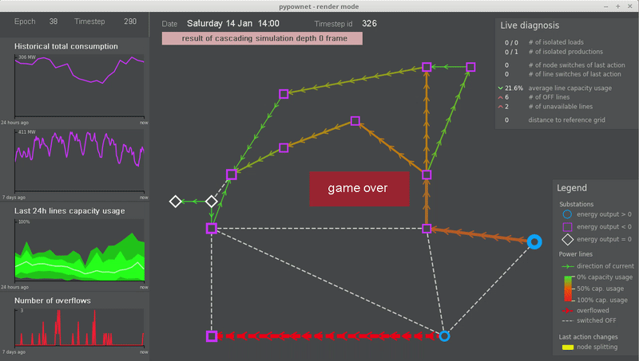

.. pypownet documentation master file, created by
   sphinx-quickstart on Wed Aug 22 21:29:30 2018.
   You can adapt this file completely to your liking, but it should at least
   contain the root `toctree` directive.

pypownet - documentation
========================

pypownet is a simulator for power (electrical) grids able to emulate a power grid (of any size or characteristics) subject to a set of temporal injections (productions and consumptions) for discretized timesteps.

The simulator is able to simulate cascading failures, where successively overflowed lines are switched off and a loadflow is computed on the subsequent grid.
It comes with an Reinforcement Learning-focused environment, which implements states (observations), actions (reduced to node-splitting and line status switches) as well as a reward signal.
Also, the simulator possess a runner module for easily benchmarking new controlers, and has a renderer module that allows to observe the evolving grid and the actions of a controler.

.. toctree::
   :maxdepth: 3
   :caption: Quick start
   
   introduction.rst
   installation.rst
   basic_usage.rst

.. toctree::
   :maxdepth: 3
   :caption: Create new agents

   basic_agents.rst
   env_info.rst
   example_agents.rst

.. toctree::
   :maxdepth: 4
   :caption: Simulator parameters

   params_context.rst
   params_default.rst
   game_settings.rst

.. toctree::
   :maxdepth: 0
   :caption: Miscellaneous

   changelog.rst

* :ref:`genindex`
* :ref:`modindex`
