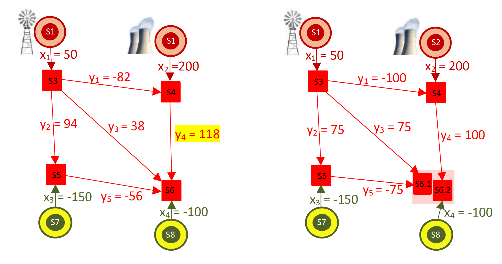

============
Introduction
============

pypownet stands for Python Power Network, which is a simulator for power (electrical) networks.

The simulator is able to emulate a power grid (of any size or characteristics) subject to a set of temporal injections (productions and consumptions) for discretized timesteps. Loadflow computations relies on Matpower and can be run under the AC or DC models. The simulator is able to simulate cascading failures, where successively overflowed lines are switched off and a loadflow is computed on the subsequent grid.

The simulator comes with an Reinforcement Learning-focused environment, which implements states (observations), actions (reduced to node-splitting and line status switches) as well as a reward signal.
Finally, a renderer is available, such that the observations of the network can be plotted in real-time (synchronized with the game time).

Background
**********

Motivations
^^^^^^^^^^^

.. Hint:: This subsection was extracted from Marvin Lerousseau's master thesis on the development of pypownet (the document was written half way through the project, so some aspects are renewed, but the main ideas are the same) available `here <https://github.com/MarvinLer/pypownet/blob/master/doc/project_introduction.pdf>`_.

This project addresses technical aspects related to the transmission of electricity in extra high voltage and high voltage power networks (63kV and above), such as those managed by the company RTE (Réseau de Transport d’Electricité) the French TSO (Transmission System Operator).
Numerous improvements of the efficiency of energy infrastructure are anticipated in the next decade from the deployment of smart grid technology in power distribution networks to more accurate consumptions preditive tools.
As we progress in deploying renewable energy harnessing wind and solar power to transform it to electric power, we also expect to see growth in power demand for new applications such as electric vehicles.
Electricity is known to be difficult to store at an industrial level. Hence supply and demand on the power grid must be balanced at all times to the extent possible.
Failure to achieve this balance may result in network breakdown and subsequent power outages of various levels of gravity.
Principally, shutting down and restarting power plants (particularly nuclear power plants) is very difficult and costly since there is no easy way to switching on/off generators.
Many consumers, including hospitals and people hospitalized at home as well as factories critically suffer from power outages.
Using machine learning (and in particular reinforcement learning) may allow us to optimize better the operation of the grid eventually leading to reduce redundancy in transmission lines, and make better utilization of generators, and lower power prices.
We developed pypownet to this end, which allows to train RL models for the task of grid conduct.

Power grid systems
^^^^^^^^^^^^^^^^^^
A power grid is an network made of electric hardware and intended to transmit electricity from productions to consumptions.
See next figure for a representation of two power grids with 2 productions and 2 consumptions:

    Example of a power grid with 2 productions (top), 2 consumptions (bottom) and 4 substations (pink) which contain 1 or 2 nodes (red square)

Formally, the structure of a power grid is a graph G = {V, E} with V the set of nodes and E the set of edges.
Edges are the power lines, also called branches or transmission lines.
In practice, V is the set of substations which are concretely made of electric poles on which the connectible elements can be wired.
TSOs technicians can change the pole on which an element is connected by operating switches (in pypownet, there at two poles per substation, i.e. two nodes per susbstation).
They can also switch off elements such as branches such that they are temporarily removed from the grid (to repaint power lines for example).

On top of the graph structure, a power grid is submitted to Kirchoff’s laws.
For instance, at any node, the sum of input power is equal to the sum of output power.
Given a set of injections (productions and consumptions values), a network structure and physical laws, a power grid will naturally converge to an equilibrium, also called a steady-state.
In pypownet, the time is discretized into timesteps (of any given duration > 1 minute, depending on the environment).
At each timestep, there will be new injections to the grid, as well as maintenance and random hazards that will force some lines to be unavailable, then apply the action given by the controler (or player), and then compute the new seatdy-state of the system, giviing a new observation to the controler.

Grid conduct and safety criteria
^^^^^^^^^^^^^^^^^^^^^^^^^^^^^^^^
A branch is said overflowed when its flowing current is above its thermal threshold.
The more current in a power line, the more it heats, which causes a dilatation phenomenon of the line.
The air between the line and the ground acts as insulation and might then not been sufficient to protect nearby passengers from electric arcs.
Apart from the security of nearby passengers, a melted power line needs to be replaced which can take several weeks to replace in the context of very-hight voltage power grids with an associated cost of millions of euros.
On top of econominal and security cost, broken lines only reduce the capacity of the grid in term of total power, and can isolate areas which could contain hospitals where the security of thousands of people are at higher risk.
Dispatchers perform actions in order to maintain their grid as safe as possible, with limited probabilities of global outage or any failure.
In pypownet, controlers control two types of actions:

    - switches the status of lines (e.g. disconnect a ON line or connect an OFF line)
    - switches the node of which the productions, consumptions and lines are connected within substations: this changes the overall topology of the grid, by bringing "new" nodes

TSOs usually operate at nation-scale.
For example, RTE operates the French grid made of more than 6500 nodes, 3000 productions and 10000 branches.
Taking into account hazards, maintenance, and the injections distributions, the task of operating the grid in a safe mode is rather complex.
Besides, the human factor limits the tools used for predicting the grid subsequent states.
For example, temperature estimations and weather predictions could be integrated when managing the grid, but would only complicate the task for dispatchers.
In this context, we are interested in building a policy Π : S → A (S is the State set and A the Action set), that would propose multiple curative solutions given grid states such that operators could take decisions rapidly by selecting an action among the candidate ones.

The role of pypownet is to emulate a grid as closely as possible from real life conditions, such that models can be trained using custom data and much quicker than real life.

Main features
*************
pypownet is a power grid simulator, that emulates a power grid that is subject to pre-computed injections, planned maintenance as well as random external hazards. Here is a list of pypownet main features:

    - emulates a grid of any size and electrical properties in a game discretized in timesteps of any (fixed) size
    - computes and apply cascading failure process: at each timestep, overflowed lines with certain conditions are switched off, with a consequent loadflow computation to retrieve the new grid steady-state, and reiterating the process
    - has an RL-focused interface, where players or controlers can play actions (node-splitting or line status switches) on the current grid, based on a partial observation of the grid (high dimension), with a customable reward signal (and game over options)
    - has a renderer that enables the user to see the grid evolving in real-time, as well as the actions of the controler currently playing and further grid state details (works only for pypownet official grid cases)
    - has a runner that enables to use pypownet fully by simply coding an agent (with a method act(observation))
    - possess some baselines models (including treesearches) illustrating how to use the furnished environment
    - can be launched with CLI with the possibility of managing certain parameters (such as renderer toggling or the agent to be played)
    - functions on both DC and AC mode
    - has a set of parameters that can be customized (including AC or DC mode, or hard-overflow coefficient), associated with sets of injections, planned maintenance and random hazards of the various chronics
    - handles node-splitting (at the moment only max 2 nodes per substation) and lines switches off for topology management

